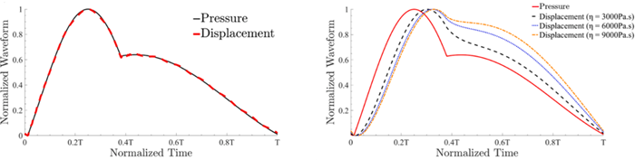
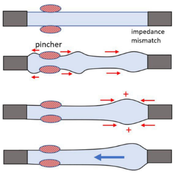
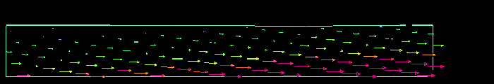
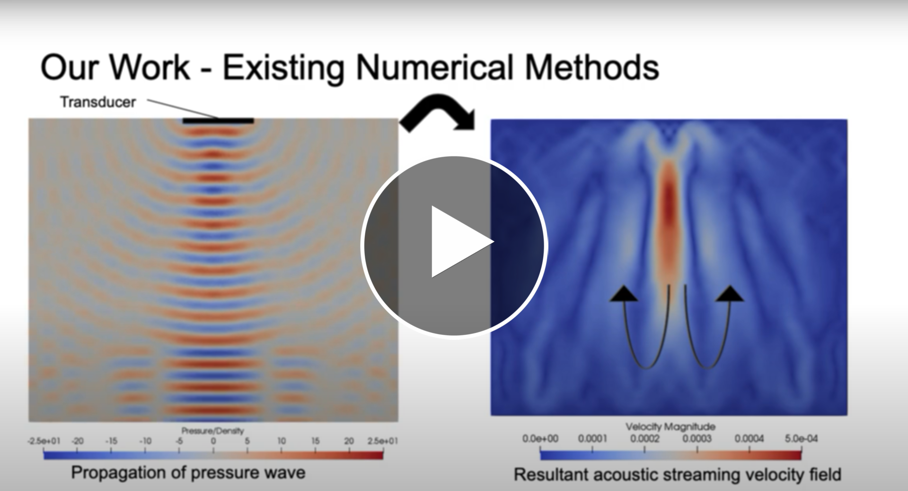

	<h2 class="section-heading text-uppercase">Hemodynamic Simulation Research</h2>

I had the privilege of working in [Dr. Niema Pahlevan's](https://viterbi.usc.edu/directory/faculty/Pahlevan/Niema) biomechanical research lab at the University of Southern California from 2020-2022. Under the guidance of Dr. Pahlevan and his then-PhD student (now Dr.) [Arian Aghilinejad](https://www.linkedin.com/in/arian-aghilinejad-85828b108/), I coauthored two papers on cardiovascular fluid dynamics.

The first paper, [Effects of vessel wall mechanics on non-invasive evaluation of 
cardiovascular intrinsic frequencies](https://github.com/brogers622/portfolio/blob/18c59b9fa894b4369f521322821fec689fcc526e/1st%20coauthored%20paper.pdf), investigated the correlation between fluid pressure inside a blood vessel and the radial displacement of the vessel wall over a cardiac cycle under various physiological conditions.

The second paper, [On the Longitudinal Wave Pumping in Fluid-filled Compliant Tubes](https://github.com/brogers622/portfolio/blob/18c59b9fa894b4369f521322821fec689fcc526e/2nd%20coathored%20paper.pdf), explored the frequency-dependent pumping behavior that manifests in compliant tubes subjected to cyclic axial stretching.
### Paper 1
The first paper investigated intrinsic frequency (IF), a novel index of cardiovascular health proposed by Dr. Pahlevan. The calculation of one's IF requires a measurement of intravascular pressure as a function of time over a cardiac cycle. Like traditional blood pressure measured by a cuff at home or in a clinic, IF is proposed as a holistic indicator of overall cardiovascular functioning. Unfortunately, the invasiveness of measuring intravascular blood pressure limits the universality of IF measurement. It would thus be valuable to have an alternative means of calculating IF that did not require an invasive intravascular pressure measurement. One potential option is the derivation of IF not from a pressure wave, but rather the radial enlargement of a blood vessel that accompanies the pressure changes over a cardiac cycle. This *displacement wave* can be measured non invasively, and inspires the motivating question underlying this paper: *how closely does displacement-based IF approximate pressure-based IF?*

This investigation consisted of an analytical approach handled by my colleagues and a computational approach handled by me. I was responsible for using computational fluid dynamics tools to simulate an aorta undergoing a cardiac cycle under various physiological conditions, and to extract pressure and displacement data from the simulations for IF analysis.

The figure below shows the simplified axisymmetric aorta model I arrived at by assuming that aortic branching, turns/twists, and diameter variation all negligibly affected the wave behavior of interest.

Using the finite element solver ADINA, I generated a discretized fluid-solid interaction version of the above model. I applied physiologically-relevant boundary and initial conditions, developed and applied vessel wall material models, validated spatial and temporal discretization, ran simulations for multiple cardiac cycles until periodic steady state was reached, then extracted pressure and displacement data and plotted it using Matlab. I executed about 20 different cases manually. Parameters varied between cases included vessel geometry, vessel wall material properties, and inlet blood velocity waveform.

As shown in the plots below, the simulations suggested that displacement-based and pressure-based IF agree strongly if the vessel wall is purely elastic, but error increases with wall viscoelasticity. My colleague's analytical predictions agreed with the data reported by my simulations.

### Paper 2
The second paper entailed a similar exploration but with different goals. Whereas the first paper had more immediate clinical relevance, this paper was a fundamental physics exploration of the impedence pumping behavior of compliant vessels due to longitudinal stretching.

*Impedence pumping* is a valveless pumping effect in which a net flow arises in a compliant tube due periodic agitation of the vessel wall. The most common type of impedence pump is the *radial impedence pump*, illustrated in the diagram below, in which the vessel wall is compressed radially and released in a periodic fashion. Depending on vessel geometry and compression frequency, this can result in a net flow.

Our paper explored *longitudinal* impedence pumping, illustrated below, in which the cyclic agitation is in the direction of the vessel axis. This type of impedence pump is less studied than its radial counterpart.

Like the first paper, we undertook both analytical and computational approaches, and I was responsible for the simulations. I used the same software and a similar vessel model, although with some new boundary conditions and material definitions. The video below shows a custom stretch-and-release boundary condition I developed to simulate longitudinal pumping.

The primary difference in my experience of and contribution to this paper was the number of cases I needed to simulate. For the first paper I ran about 20 cases manually, which was quite labor intensive and allowed room for user error in naming files, typing parameter values correctly, etc. In the second paper, I needed to generate, execute, and postprocess well over 100 cases with different stretch frequencies, stretch magnitudes, vessel wall stiffnesses, and vessel lengths. Knowing that manual execution of this many cases was not feasible, I sought to automate the process.

Fortunately, ADINA can be operated manually via its UI *or* programmatically by feeding it a .txt file of ADINA commands. In order to automate the entire process, I wrote a script in Matlab to generate two .txt files containing ADINA commands to preprocess and postprocess a case, and a second Matlab script to clean and plot data that was extracted from a case after its successful execution. Finally, I wrote a main script for the command line that fed the parameters of the case to Matlab and orchestrated the transfer of information between ADINA and Matlab. The diagram below illustrates the interaction of Matlab, ADINA, and the command line in this process.

In the end, the simulations and analytical approach predicted a highly frequency depended pumping behavior of the vessel, which could produce a net flow forward, backward, or not at all depending on the frequency.
### Acoustic Streaming Research + Presentation
Before working with Dr. Pahlevan, I also worked under [Dr. Anita Penkova](https://viterbi.usc.edu/directory/faculty/Penkova/Anita) to investigate the fluid dynamics of [acoustic streaming](https://en.wikipedia.org/wiki/Acoustic_streaming#:~:text=Acoustic%20streaming%20is%20a%20steady,waves%20within%20a%20Kundt's%20tube.), a net flow induced by sound waves in a fluid. I investigated the phenomenon using the open source computational fluid dynamics tool OpenFOAM, and presented my team's findings in a virtual undergraduate symposium:

